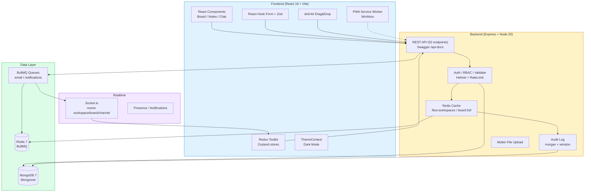
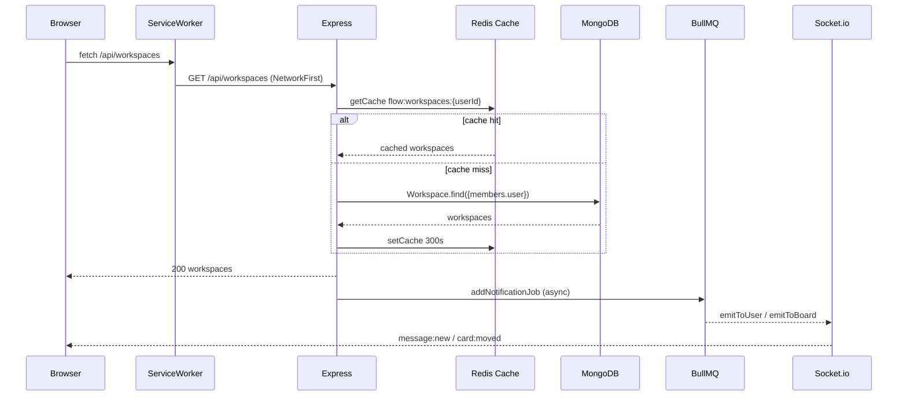
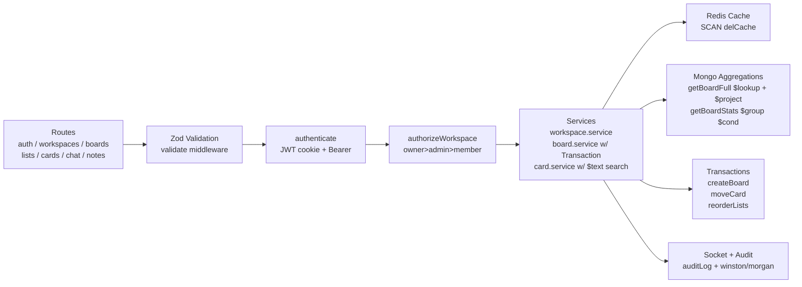
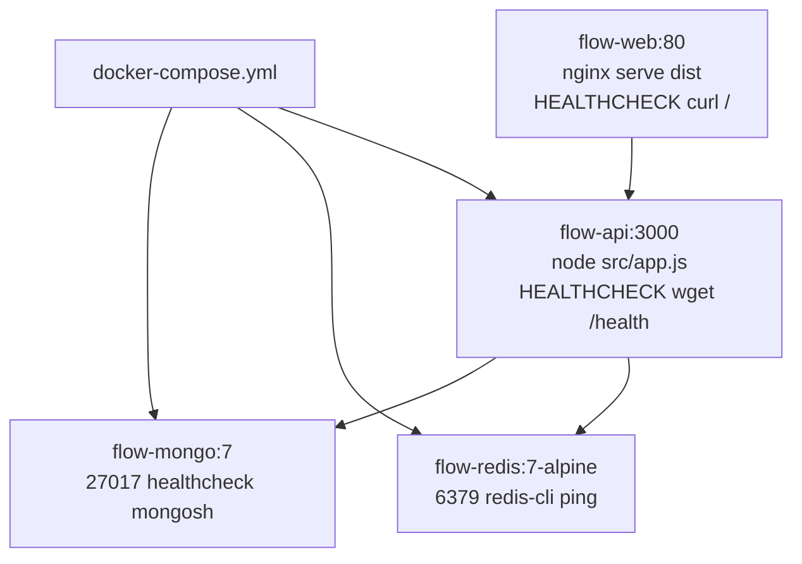

# Flow - Architecture Diagram

## Overview
Mini SaaS inspired by Notion/Trello/Slack built with Express + MongoDB + Redis + Socket.io and React + Vite.

## High-Level Architecture

## Request Flow

## Backend Layers

## Deployment (Docker)

## Security & Logging

- Helmet, CORS (origin: env.CORS_ORIGIN), rateLimit 100/90s, strictQuery, bcrypt 12, httpOnly secure cookies, Zod validation, RBAC hierarchy, sanitizeBody for audit.
- Logging: morgan combined → winston (json + colorize, file logs/error.log in prod), auditLog middleware to AuditLog collection.

## References

- Source: `backend/src/app.js:26` helmet/cors, `backend/src/middleware/rbac.js:7`, `backend/src/config/redis.js:26`, `backend/src/config/logger.js:1`, `docs/openapi.yaml:1`
- Live docs: `http://localhost:3000/api-docs` (Swagger), `http://localhost:3000/health`
