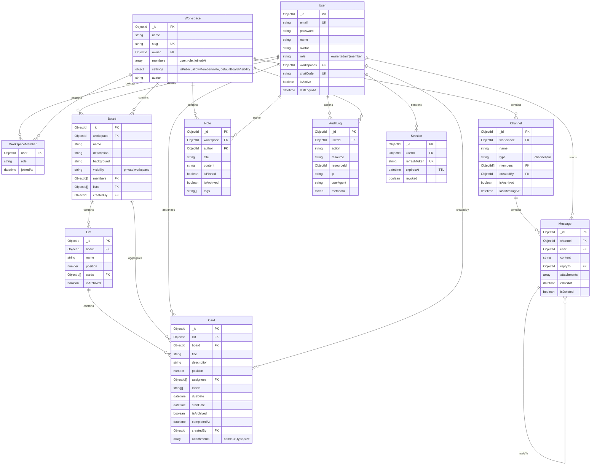

# Flow - ER Diagram

## Entity Relationship Diagram (Mermaid)

## Collections & Indexes

- **User** `user.model.js:45` text index `name`, unique `email`, `chatCode`
- **Workspace** `workspace.model.js:23` `owner:1`, `members.user:1`, unique `slug`
- **Board** `board.model.js:14` `workspace:1,createdAt:-1`, `members:1`
- **List** `list.model.js:11` `board:1,position:1`
- **Card** `card.model.js:24` `list:1,position:1`, `board:1,isArchived:1`, `assignees:1`, `dueDate:1`, text `title+description:28`
- **Channel** `channel.model.js:14` `workspace:1,type:1`, `members:1`
- **Message** `message.model.js:18` `channel:1,createdAt:-1`, `user:1`
- **Note** `note.model.js:13` `workspace:1,createdAt:-1`, text `title+content:14`
- **AuditLog** `audit.model.js:13` `userId:1,createdAt:-1`, `resource:1,resourceId:1`, indexes on `userId,action,resource`

## Relationships Notes

- Workspace `members` embeds role hierarchy `owner(3)>admin(2)>member(1)` used in `rbac.js:1` and `workspace.service.js:134 getMemberRole`
- Board `visibility` private limits to `members` + `createdBy` (`board.service.js:74`)
- List `position` spaced `*1000` allows reorder without reindex, transaction in `reorderLists:64`
- Card `board` denormalized for `$text` search without join; move uses transaction (`card.service.js:88`)
- Channel `members` `$all + $size:2` for DM uniqueness (`chat.service.js:61`)
- Message `replyTo` self-ref, audit `metadata` sanitizes `password` (`audit.js:31`)

## Aggregations Referenced

- `getBoardFull:87` `$match board + $lookup cards pipeline $lookup users`
- `getBoardStats:180` `$lookup cards $group total/overdue/assignedToMe $cond`

## Diagram Source

Generated from Mongoose schemas in `backend/src/modules/*/*.model.js`, indexes verified via `model.js` files.

## Visual Export

For PNG export: paste mermaid code into https://mermaid.live and export PNG to `docs/er-diagram.png`.
